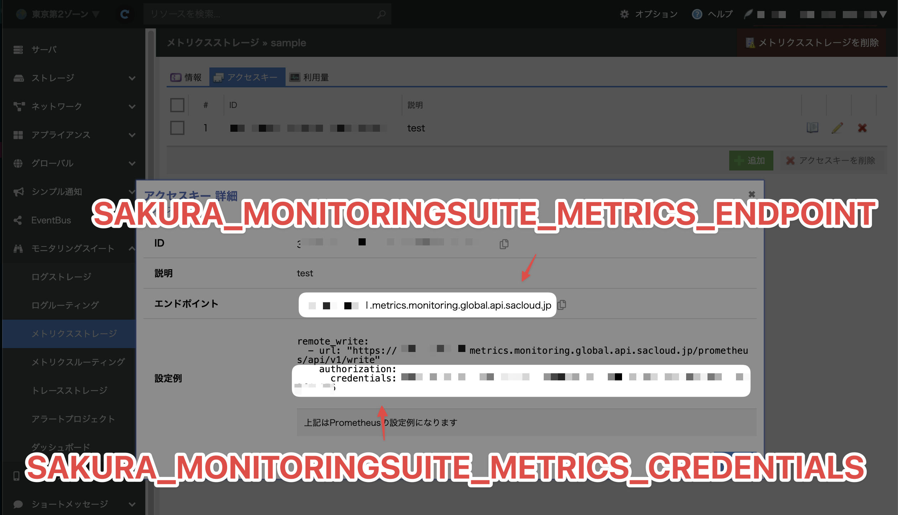
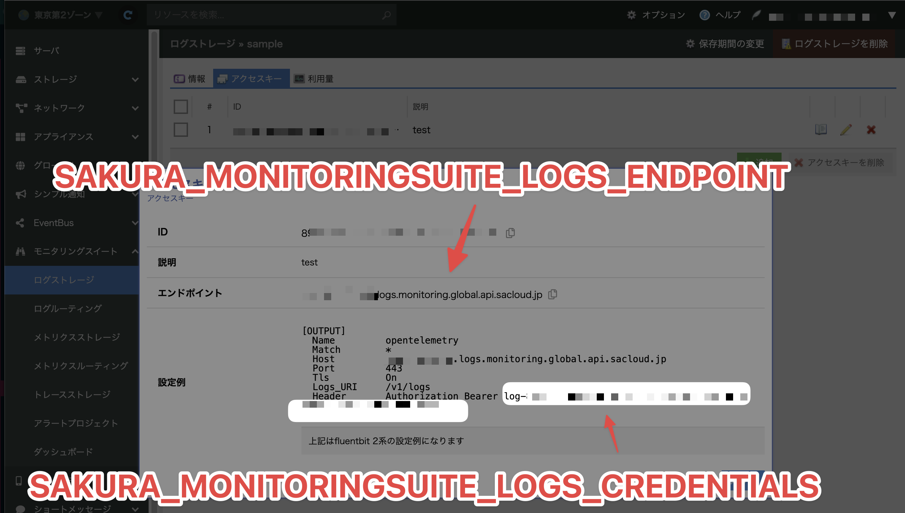

# ｢さくらのクラウドのモニタリングスイートにotelcolで送信する本｣のサンプルコード集

[さくらのクラウドのモニタリングスイートにotelcolで送信する本](https://zenn.dev/tokuhirom/books/7c2c7820b2c36c) のサンプルコードです｡

## 依存ツール

- docker-compose
- dotenv

## セットアップ手順

### `.env` ファイルの作成

.env を設定します｡

メトリクスの設定情報は以下のように取得してください｡



ログの設定情報は以下のように取得してください｡



ファイルの中身は以下のように記述します｡

このサンプルでは sacloud exporter を使用しています｡エンドポイント ID (12桁の数字) のみを指定すれば､自動的に完全な URL に展開されます｡

```ini
# メトリクス設定
SACLOUD_METRICS_ENDPOINT=123456789012
SACLOUD_METRICS_TOKEN=met-***-***

# ログ設定
SACLOUD_LOGS_ENDPOINT=123456789012
SACLOUD_LOGS_TOKEN=log-***-***
```

また､完全な URL を指定することも可能です｡

```ini
# メトリクス設定（URL形式）
SACLOUD_METRICS_ENDPOINT=https://123456789012.metrics.monitoring.global.api.sacloud.jp/prometheus/api/v1/write
SACLOUD_METRICS_TOKEN=met-***-***

# ログ設定（URL形式）
SACLOUD_LOGS_ENDPOINT=https://123456789012.logs.monitoring.global.api.sacloud.jp
SACLOUD_LOGS_TOKEN=log-***-***
```

## 実装済みのサンプル

現在､以下のようなサンプルコードが設置されています｡

- metrics-hostmetrics: hostmetrics を送信する例
- metrics-otlp: OTLP で受信したメトリクスを送信する例
- logs-docker: Docker のログを転送する例
- logs-nginx: nginx のログを転送する例

## LICENSE

See LICENSE file.
